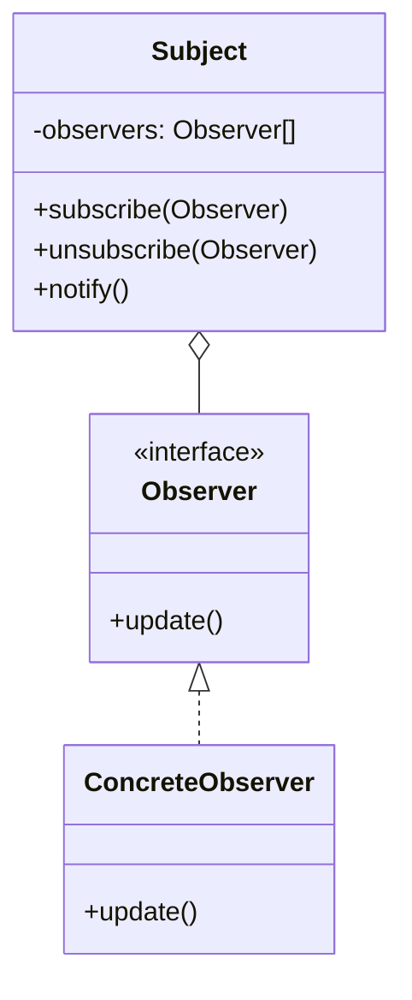
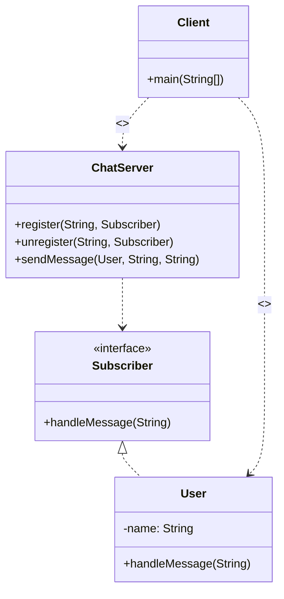

# 옵저버 (Observer) 패턴

다수의 객체가 특정 객체 상태 변화를 감지하고 알림을 받는 패턴입니다. 발행(publish)–구독(subscribe) 패턴을 이 구조로 구현할 수 있습니다.

강의 슬라이드(`docs/디자인패턴-1040906.pdf` 84–87쪽)와 이 패키지 소스를 기준으로 정리합니다.

## 구조



- **Subject (발행자)**: 옵저버 목록을 들고 `subscribe` / `unsubscribe` / `notify`를 제공합니다. 상태가 바뀌면 `notify()`로 등록된 옵저버의 `update()`를 호출합니다.
- **Observer (구독자 인터페이스)**: 알림을 받을 때 호출될 메서드를 정의합니다.
- **ConcreteObserver**: 실제로 알림을 처리합니다. Subject는 구체 타입이 아니라 인터페이스만 봅니다.

이 예제에서는 역할 이름이 채팅 도메인에 맞춰 바뀝니다.

| GoF | 이 예제 |
| --- | --- |
| Subject | `ChatServer` |
| Observer | `Subscriber` |
| ConcreteObserver | `User` |
| update() | `handleMessage(String)` |

## 패키지

```text
p19_observer
├── s01_before   # 패턴 적용 전: 메시지를 직접 조회(폴링)
├── s02_after    # 패턴 적용 후: 주제별 구독 후 푸시 알림
└── s03_java     # Java · Spring에서 찾아보는 옵저버
    ├── t01_observer  # java.util.Observable / Observer
    ├── t02_property  # PropertyChangeListener
    ├── t03_flow      # Flow API
    └── t04_spring    # Spring ApplicationEvent
```

## s01_before — 적용 전

`ChatServer`는 주제(`subject`)별로 메시지를 `Map`에 쌓고, `User`는 필요할 때 `getMessage()`로 **직접 꺼내 봅니다**. 새 메시지가 왔는지 서버가 알려주지 않으므로 구독자가 주기적으로 조회해야 합니다.

```java
User user1 = new User(chatServer);
user1.sendMessage("디자인패턴", "이번엔 옵저버 패턴입니다.");

User user2 = new User(chatServer);
System.out.println(user2.getMessage("디자인패턴"));  // 직접 조회
```

실행: `s01_before.Client`

한계는 슬라이드의 장점과 반대입니다. Subject 상태 변화를 **자동으로 감지하지 못하고**, 구독자가 서버 구현(`getMessage`)에 묶입니다.

## s02_after — 적용 후

주제마다 `Subscriber` 목록을 두고, 메시지가 오면 해당 주제 구독자에게 `handleMessage`를 **밀어 줍니다**.



`Client` 흐름:

1. `keesun`, `whiteship`이 `"오징어게임"`을 구독하고, `keesun`만 `"디자인패턴"`을 구독합니다.
2. `"오징어게임"`으로 보내면 **둘 다** 알림을 받습니다.
3. `"디자인패턴"`으로 보내면 **keesun만** 받습니다.
4. `unregister`로 런타임에 구독을 끊을 수 있습니다.

```java
chatServer.register("오징어게임", user1);
chatServer.register("오징어게임", user2);
chatServer.register("디자인패턴", user1);

chatServer.sendMessage(user1, "오징어게임", "아.. 이름이 기억났어.. 일남이야.. 오일남");
// [keesun] keesun: ...
// [whiteship] keesun: ...
```

실행: `s02_after.Client`

`ChatServer`는 `User`가 아니라 `Subscriber`만 알면 됩니다. 새 구독자 타입을 추가해도 서버 코드를 바꿀 필요가 없습니다.

## 장단점

슬라이드 기준입니다.

**장점**

- 상태를 변경하는 객체(publisher)와 변경을 감지하는 객체(subscriber)의 관계를 **느슨하게** 유지할 수 있다.
- Subject의 상태 변경을 주기적으로 조회하지 않고 **자동으로** 감지할 수 있다.
- **런타임에** 옵저버를 추가하거나 제거할 수 있다.

**단점**

- 복잡도가 증가한다.
- 다수의 Observer를 등록한 뒤 **해지하지 않으면 memory leak**이 발생할 수 있다. (`s02_after.ChatServer`의 `WeakReference` import는 이 이슈를 의식한 흔적입니다. 실제 해제 경로는 `unregister`입니다.)

## s03_java — Java · Spring

슬라이드에 나온 API와 예제 클래스 대응입니다.

| 슬라이드 | 예제 |
| --- | --- |
| `Observable` / `Observer` (Java 9부터 deprecated) | `t01_observer.ObserverInJava` |
| `PropertyChangeListener`, `PropertyChangeEvent` | `t02_property.PropertyChangeExample` |
| Flow API | `t03_flow.FlowInJava`, `FlowInSyncJava` |
| SAX | 이 패키지에는 없음. XML 파서가 이벤트 콜백으로 요소를 알려 주는 구조 |
| Spring `ApplicationContext` / `ApplicationEvent` | `t04_spring.ObserverInSpring`, `MyEvent`, `MyEventListener`, `MyRunner` |

### Java — `t01_observer.ObserverInJava`

`java.util.Observable`이 Subject, `java.util.Observer`가 구독자입니다. `setChanged()` 후 `notifyObservers(message)`로 알립니다. Java 9부터 deprecated라 신규 코드에는 쓰지 않는 것이 맞습니다.

### Java — `t02_property.PropertyChangeExample`

JavaBeans `PropertyChangeSupport`가 옵저버 목록을 대신 관리합니다. `firePropertyChange`로 알리고, `removeObserver` 이후 메시지는 구독자에게 가지 않습니다.

### Java — `t03_flow.FlowInJava`

Java 9 `java.util.concurrent.Flow`(Reactive Streams). `SubmissionPublisher`가 Publisher, `Flow.Subscriber`가 구독자입니다. `submit`은 다른 스레드에서 `onNext`를 호출할 수 있어 `"이게 먼저 출력될 수도 있습니다."`가 `hello java`보다 먼저 나올 수 있습니다.

같은 패키지의 `FlowInSyncJava`는 Publisher를 직접 구현해 `subscribe` 안에서 `onNext` / `onComplete`를 **같은 스레드에서** 호출합니다. 그래서 `"위의 처리가 다 끝나야지 출력됩니다."`는 구독자 콜백이 끝난 뒤에 나옵니다.

### Spring — `t04_spring` 애플리케이션 이벤트

`ObserverInSpring`이 비웹(`WebApplicationType.NONE`)으로 기동합니다.

- **Publisher**: `MyRunner`가 `ApplicationEventPublisher.publishEvent(...)`로 이벤트를 발행합니다.
- **Event**: `MyEvent`는 `ApplicationEvent`를 상속한 메시지 페이로드입니다. Spring 4.2부터는 `ApplicationEvent`를 상속하지 않은 POJO도 `@EventListener`로 받을 수 있습니다.
- **Subscriber**: `MyEventListener`가 `ApplicationListener<MyEvent>`를 구현하고 `onApplicationEvent`에서 처리합니다. `@Component`로 등록되면 스프링 컨테이너가 등록·해제를 맡습니다.

실행: `s03_java.t04_spring.ObserverInSpring`

## 실행

프로젝트 루트에서 컴파일한 뒤, 각 `main`이 있는 클래스를 실행합니다.

```bash
./gradlew compileJava
```

| 단계 | 클래스 |
| --- | --- |
| 적용 전 | `d03_behavioral_patterns.p19_observer.s01_before.Client` |
| 적용 후 | `d03_behavioral_patterns.p19_observer.s02_after.Client` |
| Java Observable | `...s03_java.t01_observer.ObserverInJava` |
| Java PCL | `...s03_java.t02_property.PropertyChangeExample` |
| Java Flow (비동기) | `...s03_java.t03_flow.FlowInJava` |
| Java Flow (동기) | `...s03_java.t03_flow.FlowInSyncJava` |
| Spring Event | `...s03_java.t04_spring.ObserverInSpring` |
